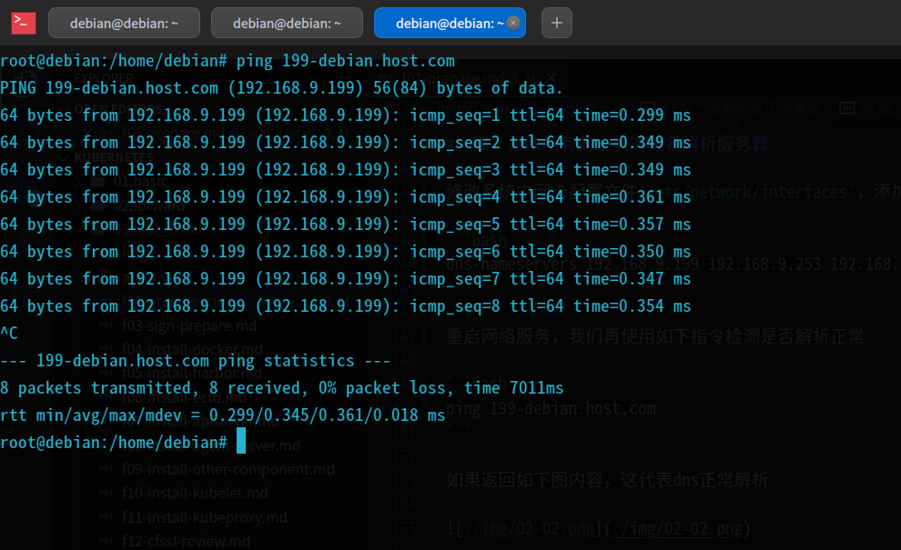

# k8s二进制安装环境准备

## 一、物理机器准备

准备基础的设备如下

|      IP       |            操作系统            |               配置               |             备注              |
| ------------- | ------------------------------ | -------------------------------- | ----------------------------- |
| 192.168.9.199 | Debian GNU/Linux 11 (bullseye) | 内存:12G + SSD硬盘:256G + CPU:6核 | 作为控制节点，标记为: 199-debian |
| 192.168.9.192 | Debian GNU/Linux 11 (bullseye) | 内存:8G + SSD硬盘:256G + CPU:6核 | 作为工作节点，标记为: 192-debian |
| 192.168.9.160 | Debian GNU/Linux 11 (bullseye) | 内存:8G + SSD硬盘:256G + CPU:6核 | 作为工作节点，标记为: 190-debian |

由于199这台主机资源相对充足，所以我们使用`199-debian`资源相对充足，所以我们使用这台机充当了更多的角色

- 192.168.9.199: etcd服务器、Proxy的L4、L7代理，同时作为运维主机：Docker的私有仓库、k8s资源配置清单仓库、提供共享存储（NFS）、签发证书、dns服务器

- 192.168.9.192: etcd服务器、Proxy的L4、L7代理、控制节点、工作节点

- 192.168.9.192: etcd服务器、控制节点、工作节点

## 三、初始化域名解析服务器

### 3.1 安装域名解析服务器软件

我们把 `199-debian` 这台主机作为域名服务器。接下来进行初始化操作。

安装bind9软件

```bash
apt install -y bind9
```

安装好bind之后，修改bind的配置文件`/etc/named.conf`，修改的配置参数如下

```bash
# 修改服务的IP
listen-on port 53 { 192.168.9.199; };
# 允许任意主机使用解析服务
allow-query     { any; };
# 添加 forwarders 键， 值：网关地址
forwarders      { 192.168.9.254; };
# 开启dns转发
allow-query-cache       { any; };
# 使用递归的方式
recursion yes;
#关闭sec
dnssec-enable no;
dnssec-validation no;
```

### 3.2 配置域名解析

在这里，我们不赘述域名解析以及相关软件的相关知识，如果你在阅读本文有困难时，建议先去了解 **dsn服务器** 以及 **bind9软件** 的相关知识。我们对集群中的相关主机设置相关的域名解析，以便能通过域名访问到我们对应的服务器。以下是具体操作过程：

修改区域配置文件 `/etc/bind/named.conf.local`，我们将`host.com`作为后续的业务域名，添加如下正向解析区域

```bash
zone "host.com" {
    type master;
    file "host.com.zone";
};
```

编辑区域数据文件`/etc/bind/host.com.zone`，改为如下内容

```bash
$ORIGIN host.com.
$TTL 600 ; 10 minutes
@ IN SOA dns.host.com. dnsadmin.host.com. (
    2022012002 ; serial
    10800      ; refresh (3 hours)
    900        ; retry (15 minutes)
    604800     ; expire (1 week)
    86400      ; minium (1 day)
    ) 
    NS dns.host.com.

$TTL 60    ;   1 minute
dns             A   192.168.9.199
199-debian      A      192.168.9.199
192-debian      A      192.168.9.192
160-debian      A      192.168.9.160
```

修改`/etc/bind/named.conf.options`，找到`forwarders`关键字取消注释，并设置上游dns服务器，我的局域网真实的dns是`192.168.9.253`，如下命令

```bash
forwarders {
    192.168.9.253;
};
```

启动dns服务

```bash
# 启动dns 服务
systemctl start named
# 将dns 服务设置为开机自启
systemctl enable named
```

验证dns是否正常

```bash
# 查询53端口服务
netstat -luntp | grep 53
```

可以看到53端口服务正常运行，如下图所示


查看dns是否正常解析

```bash
dig -t A 199-debian.host.com @192.168.9.199 +short
```

如果看到正常返回IP地址，则代表解析正常。

这时候，我们需要把我们的`199-debian`主机的DNS改为`我们自建的DNS服务`，修改 `/etc/network/interfaces` 文件的配置，如下

```bash
allow-hotplug enp1s0
iface enp1s0 inet static
address 192.168.9.199
netmask 255.255.255.0
gateway 192.168.9.254
dns-nameservers 192.168.9.199 192.168.9.253 192.168.9.252
```

再重启网络服务

```bash
/etc/init.d/networking restart
```

## 四、修改所有的主机的域名解析服务器

修改系统中网卡配置文件`/etc/network/interfaces`，添加`199-debian`机作为dns

```bash
dns-nameservers 192.168.9.199 192.168.9.253 192.168.9.252
```

重启网络服务，我们再使用如下指令检测是否解析正常

```bash
ping 199-debian.host.com
```

如果返回如下图内容，这代表dns正常解析



我们在 `/etc/resolv.conf` 文件中修改只是让主机临时生效，如果重启之后，系统将会根据网卡配置来指定对应的 域名解析服务器，所以永久生效的方式应当是 修改网卡 配置中的DNS域名。

`/etc/resolv.conf` 设置域名解析时，主机域名（专门用于访问主机的域名）可以使用 `search` 标注查询的主机域，但注意业务域名（用于部署项目的域名）不要使用这个配置。
