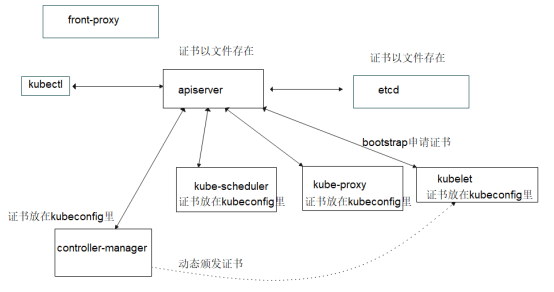

# 证书签发 环境准备

我们把 `199-debian` 这台主机作为运维主机，所以接下来很多操作都在这台主机上执行。

## 一、安装cfssl工具

cfssl 工具的下载地址为：[https://github.com/cloudflare/cfssl/releases](https://github.com/cloudflare/cfssl/releases)

我们下载安装`cfssl`、`cfssl-json`、`cfssl-certingo`，如下指令

```bash
# cfssl
wget https://github.com/cloudflare/cfssl/releases/download/1.2.0/cfssl_linux-amd64 -o /usr/local/bin/cfssl
# cfssljson
wget https://github.com/cloudflare/cfssl/releases/download/1.2.0/cfssljson_linux-amd64 -o /usr/local/bin/cfssljson
# cfssl-certinfo
wget https://github.com/cloudflare/cfssl/releases/download/1.2.0/cfssl-certinfo_linux-amd64 -o /usr/local/bin/cfssl-certinfo
# 赋予执行权限
chmod a+x /usr/local/bin/cfssl*
```

## 二、kubernetes所需要的证书

在kubernetes里涉及到很多TLS认证，所以需要做大量的证书，概括如下图



我们将生成的各个证书存放到`/etc/kubernetes/pki`里。

## 三、搭建CA

CA是证书的签发机构，签发证书的前提是有一个签发机构，下文我们搭建自己的签发机构。

### 3.1 生成CA配置

生成CA配置

```bash
cat > /etc/kubernetes/pki/ca-config.json <<EOF
{
    "signing": {
        "default": {
            "expiry": "175200h"
        },
        "profiles": {
            "www": {
                "expiry": "175200h",
                "usages": [
                    "signing",
                    "key encipherment",
                    "server auth",
                    "client auth"
                ]
            }
        }
    }
}
EOF
```

### 3.2 生成CA证书请求文件

```bash
# 生成证书请求文件
cat > /etc/kubernetes/pki/ca-csr.json <<EOF
EOF
{
    "CN": "kubernetes",
    "key": {
        "algo": "rsa",
        "size": 2048
    },
    "names": [
        {
            "C": "CN",
            "L": "Guangzhou",
            "ST": "Guangdong",
            "O": "kubernetes",
            "OU": "system"
        }
    ],
    "ca": {
        "expiry": "175200h"
    }
}

# 生成证书
cfssl gencert -ca=front-proxy-ca.pem -ca-key=front-proxy-ca-key.pem -config=front-proxy-ca-config.json -profile=www front-proxy-client-csr.json | cfssljson  -bare front-proxy-client
```

证书根字段说明

- `CN`：证书名称
- `key`：定义证书类型，algo为加密类型，size为加密长度
- `ca.expiry`：证书有效时间

names条目字段说明

- `CN`: Common Name，一般使用域名
- `C`: Country Code，申请单位所属国家，只能是两个字母的国家码。例如，中国只能是CN。
- `ST`: State or Province，省份名称或自治区名称
- `L`: Locality，城市或自治州名
- `O`: Organization name，组织名称、公司名称
- `OU`: Organization Unit Name，组织单位名称、公司部门

ca的expiry字段代表有效时间，175200h代表20年

### 2.3 生成CA自签名根证书

```bash
cfssl gencert -initca ca-csr.json | cfssljson -bare ca
```

最后一个参数指定了证书文件名，最后生成以下三个文件

`ca.csr`:  证书签名申请（Certificate Signing Request）文件
`ca.pem`: ca公钥证书
`ca-key.pem`: ca私钥证书

生成的三个文件也就是根证书包含的内容。在后续，我们给各个服务颁发证书的时候，都基于CA根证书来颁发。

## 四、生成front-proxy-client聚合层客户端证书

如果没有使用到聚合层（Aggregation Layer），则不需要做如下命令，如果需要则执行如下步骤操作。

### 4.1 搭建front-proxy-client聚合层CA

我们直接复制CA的配置，如下命令

```bash
cp ca-config.json front-proxy-ca-config.json
cp ca-csr.json front-proxy-ca-csr.json
```

### 4.2 生成front-proxy-client聚合层客户端证书

定义证书信息

```bash
cat > /etc/kubernetes/pki/front-proxy-client-csr.json <<EOF
{
  "CN": "front-proxy-client",
  "key": {
    "algo": "rsa",
    "size": 2048
  },
  "names": [
    {
      "C": "CN",
      "L": "Guangzhou",
      "ST": "Guangdong",
      "O": "kubernetes",
      "OU": "system"
    }
  ]
}
EOF
```

生成证书

```bash
cfssl gencert -ca=front-proxy-ca.pem -ca-key=front-proxy-ca-key.pem -config=front-proxy-ca-config.json -profile=www front-proxy-client-csr.json | cfssljson  -bare front-proxy-client
```

## 五、颁发kubernetes各个服务所需的证书

### 5.1 etcd服务器

定义证书信息

```bash
cat > /etc/kubernetes/pki/etcd-csr.json <<EOF
{
    "CN": "etcd",
    "hosts": [
        "127.0.0.1",
        "192.168.9.199",
        "192.168.9.192",
        "192.168.9.160",
        "192.168.9.190"
    ],
    "key": {
        "algo": "rsa",
        "size": 2048
    },
    "names": [{
        "C": "CN",
        "ST": "Guangdong",
        "L": "Guangzhou",
        "O": "kubernetes",
        "OU": "system"
    }]
}
EOF
```

生成证书

```bash
cfssl gencert -ca=ca.pem -ca-key=ca-key.pem -config=ca-config.json -profile=www etcd-csr.json | cfssljson -bare etcd
```

### 5.2 kube-apiserver

k8s的其他组件跟apiserver要进行双向TLS（mTLS）认证，所以apiserver需要有自己的证书，以下定义证书申请文件

```bash
cat > /etc/kubernetes/pki/apiserver-csr.json <<EOF
{
    "CN": "apiserver",
    "key": {
        "algo": "rsa",
        "size": 2048
    },
    "hosts": [
        "127.0.0.1",
        "10.96.0.1",
        "192.168.0.1",
        "192.168.9.199",
        "192.168.9.192",
        "192.168.9.160",
        "192.168.9.190",
        "kubernetes",
        "kubernetes.default",
        "kubernetes.default.svc",
        "kubernetes.default.svc.cluster",
        "kubernetes.default.svc.cluster.local"
    ],
    "names": [{
        "C": "CN",
        "ST": "Guangdong",
        "L": "Guangzhou",
        "O": "kubernetes",
        "OU": "system"
    }]
}
EOF
```

该证书后续被 kubernetes master 集群使用，需要将master节点的IP都填上，同时还需要填写 service 网络的第一个IP（这里填10.96.0.1和192.168.0.1），后续可能加到集群里的IP都填写上去。

生成证书

```bash
cfssl gencert -ca=ca.pem -ca-key=ca-key.pem -config=ca-config.json -profile=www apiserver-csr.json | cfssljson -bare apiserver
```

证书用于连接etcd服务器、连接keubelet使用的SSL证书，也用于本身服务的证书。

### 5.3 kube-controller-manager

controller-manager需要跟apiserver进行mTLS认证，定义证书申请文件如下

```bash
cat > /etc/kubernetes/pki/controller-manager-csr.json <<EOF
{
  "CN": "system:kube-controller-manager",
  "key": {
    "algo": "rsa",
    "size": 2048
  },
   "hosts": [
     "127.0.0.1",
     "192.168.9.199",
     "192.168.9.192",
     "192.168.9.160"
    ],
  "names": [
    {
      "C": "CN",
      "ST": "Guangdong",
      "L": "Guangzhou",
      "O": "system:kube-controller-manager",
      "OU": "system"
    }
  ]
}
EOF
```

hosts 列表包含所有 kube-controller-manager 节点 IP；CN 为 system:kube-controller-manager，O 为 system:kube-controller-manager，k8s里内置的ClusterRoleBindings system:kube-controller-manager 授权用户 kube-controller-manager所需的权限。后面组件证书都做类似操作。生成证书命令如下

```bash
cfssl gencert -ca=ca.pem -ca-key=ca-key.pem -config=ca-config.json -profile=www controller-manager-csr.json | cfssljson -bare controller-manager
```

### 5.4 kube-scheduler

kube-scheduler需要跟apiserver进行mTLS认证，生成证书申请文件如下

```bash
cat > /etc/kubernetes/pki/scheduler-csr.json <<EOF
{
  "CN": "system:kube-scheduler",
  "key": {
    "algo": "rsa",
    "size": 2048
  },
   "hosts": [
     "127.0.0.1",
     "192.168.9.199",
     "192.168.9.192",
     "192.168.9.160"
    ],
  "names": [
    {
      "C": "CN",
      "ST": "Guangdong",
      "L": "Guangzhou",
      "O": "system:kube-scheduler",
      "OU": "system"
    }
  ]
}
EOF
```

kubernetes内置的ClusterRoleBindings system:kube-scheduler将授权kube-scheduler所需的权限。生成证书命令如下

```bash
cfssl gencert -ca=ca.pem -ca-key=ca-key.pem -config=ca-config.json -profile=www scheduler-csr.json | cfssljson -bare scheduler
```

### 5.5 kube-proxy

kube-proxy需要跟apiserver进行mTLS认证，生成证书申请请求文件如下

```bash
cat > /etc/kubernetes/pki/proxy-csr.json <<EOF
{
  "CN": "system:kube-proxy",
  "key": {
    "algo": "rsa",
    "size": 2048
  },
  "names": [
    {
      "C": "CN",
      "ST": "Guangdong",
      "L": "Guangzhou",
      "O": "kubernetes",
      "OU": "system"
    }
  ]
}
EOF
```

生成证书

```bash
cfssl gencert -ca=ca.pem -ca-key=ca-key.pem -config=ca-config.json -profile=www proxy-csr.json | cfssljson -bare proxy
```

### 5.6 管理员admin能用的证书

创建证书信息

```bash
cat > /etc/kubernetes/pki/admin-csr.json << EOF 
{
  "CN": "admin",
  "key": {
    "algo": "rsa",
    "size": 2048
  },
  "names": [
    {
      "C": "CN",
      "ST": "Guangzhou",
      "L": "Guangdong",
      "O": "system:masters",
      "OU": "system"
    }
  ]
}
EOF
```

生成证书

```bash
cfssl gencert -ca=ca.pem -ca-key=ca-key.pem -config=ca-config.json -profile=peer admin-csr.json | cfssljson -bare admin
```

## 六、同步证书

在`199-denbian`生成证书之后，将证书目录`/etc/kubernetes/pki`同步到其他主机。
