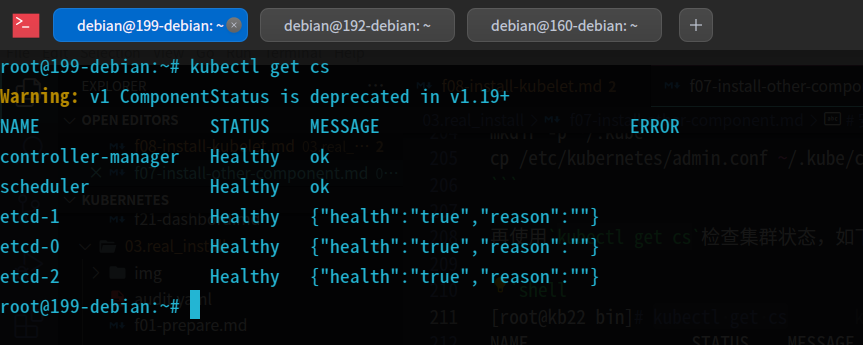

# 安装controller-manager和scheduler

## 一、创建kubectl链接

我们使用`kubectl`作为k8s的管理工具，创建一个软链接，如下

```shell
ln -s /opt/kubernetes/server/bin/kubectl /usr/local/bin/kubectl
```

## 二、安装controller-manager

### 2.1 创建配置

controller-manager和apiserver之间的认证是通过kubeconfig的方式来认证的，即controller-manager的私钥、公钥及CA的证书要放在一个kubeconfig文件里。下面创建controller-manager所用的kubeconfig文件kube-controller-manager.kubeconfig，现在在`/etc/kubernetes/pki`里创建，然后移动到`/etc/kubernetes`里。

```bash
# 进入证书目录
cd /etc/kubernetes/pki/

# 设置集群信息
kubectl config set-cluster kubernetes --certificate-authority=ca.pem --embed-certs=true --server=https://192.168.9.190:7443 --kubeconfig=kube-controller-manager.kubeconfig

# 设置用户信息，这里用户名是system:kube-controller-manager ，也就是前面controller-manager-csr.json里CN指定的。
kubectl config set-credentials system:kube-controller-manager --client-certificate=controller-manager.pem --client-key=controller-manager-key.pem --embed-certs=true --kubeconfig=kube-controller-manager.kubeconfig

# 设置上下文信息
kubectl config set-context system:kube-controller-manager --cluster=kubernetes --user=system:kube-controller-manager --kubeconfig=kube-controller-manager.kubeconfig

# 设置默认的上下文
kubectl config use-context system:kube-controller-manager --kubeconfig=kube-controller-manager.kubeconfig

# 将生成的证书移到/etc/kubernetes/
mv kube-controller-manager.kubeconfig /etc/kubernetes/
```

`/etc/kubernetes/kube-controller-manager.kubeconfig`配置文件只需生成一次，再传到其他主机即可。

### 2.1 创建启动脚本

创建文件`/opt/kubernetes/server/bin/kube-controller-manager.sh`，添加以下内容

```shell
#!/bin/bash
./kube-controller-manager \
    --v=2 \
    --logtostderr=true \
    --bind-address=127.0.0.1 \
    --root-ca-file=/etc/kubernetes/pki/ca.pem \
    --cluster-signing-cert-file=/etc/kubernetes/pki/ca.pem \
    --cluster-signing-key-file=/etc/kubernetes/pki/ca-key.pem \
    --service-account-private-key-file=/etc/kubernetes/pki/ca-key.pem \
    --kubeconfig=/etc/kubernetes/kube-controller-manager.kubeconfig \
    --leader-elect=true \
    --use-service-account-credentials=true \
    --node-monitor-grace-period=40s \
    --node-monitor-period=5s \
    --pod-eviction-timeout=2m0s \
    --controllers=*,bootstrapsigner,tokencleaner \
    --allocate-node-cidrs=true \
    --cluster-cidr=10.244.0.0/16 \
    --node-cidr-mask-size=24
```

添加执行权限与创建日志目录

```shell
# 添加可执行权限
chmod +x /opt/kubernetes/server/bin/kube-controller-manager.sh
```

创建supervisor脚本启动管理文件`/etc/supervisor/conf.d/kube-controller-manager.conf`，添加以下内容

```ini
[program:kube-controller-manager-199]
directory=/opt/kubernetes/server/bin
command=/opt/kubernetes/server/bin/kube-controller-manager.sh
numprocs=1
autostart=true
autorestart=true
startsecs=30
startretries=3
exitcodes=0,2
stopsignal=QUIT
stopwaitsecs=10
user=root
redirect_stderr=true
stdout_logfile=/data/logs/supervisor/controller.stdout.log
stdout_logfile_maxbytes=64MB
stdout_logfile_backups=4
stdout_capture_maxbytes=1MB
stdout_event_enabled=false
```

更新supervisor

```shell
supervisorctl update
```

## 三、部署scheduler

### 3.1 创建配置

controller-manager和apiserver之间的认证是通过kubeconfig的方式来认证的，即controller-manager的私钥、公钥及CA的证书要放在一个kubeconfig文件里。下面创建controller-manager所用的kubeconfig文件kube-controller-manager.kubeconfig，现在在/etc/kubernetes/pki里创建，然后剪切到/etc/kubernetes里。

```bash
# 设置集群信息
kubectl config set-cluster kubernetes --certificate-authority=ca.pem --embed-certs=true --server=https://192.168.9.190:7443 --kubeconfig=kube-scheduler.kubeconfig

# 设置用户信息
kubectl config set-credentials system:kube-scheduler --client-certificate=scheduler.pem --client-key=scheduler-key.pem --embed-certs=true --kubeconfig=kube-scheduler.kubeconfig

# 设置上下文信息
kubectl config set-context system:kube-scheduler --cluster=kubernetes --user=system:kube-scheduler --kubeconfig=kube-scheduler.kubeconfig

# 设置默认的上下文
kubectl config use-context system:kube-scheduler --kubeconfig=kube-scheduler.kubeconfig

# 剪切到/etc/kubernetes
mv kube-scheduler.kubeconfig /etc/kubernetes/
```

`/etc/kubernetes/kube-scheduler.kubeconfig`配置文件也只需生成一次，再传到其他主机即可。

### 3.2 创建启动脚本

创建scheluder启动脚本文件`/opt/kubernetes/server/bin/kube-scheduler.sh`文件，添加以下内容

```shell
#!/bin/bash
./kube-scheduler \
    --v=2 \
    --logtostderr=true \
    --bind-address=127.0.0.1 \
    --leader-elect=true \
    --kubeconfig=/etc/kubernetes/kube-scheduler.kubeconfig
```

添加脚本执行权限与创建日志目录

```shell
# 添加脚本的可执行权限
chmod +x /opt/kubernetes/server/bin/kube-scheduler.sh
```

创建进程管理配置文件`/etc/supervisor/conf.d/kube-scheduler.conf`文件，添加以下内容

```ini
[program:kube-scheduler-199]
directory=/opt/kubernetes/server/bin
command=/opt/kubernetes/server/bin/kube-scheduler.sh
numprocs=1
autostart=true
autorestart=true
startsecs=30
startretries=3
exitcodes=0,2
stopsignal=QUIT
stopwaitsecs=10
user=root
redirect_stderr=true
stdout_logfile=/data/logs/supervisor/scheduler.stdout.log
stdout_logfile_maxbytes=64MB
stdout_logfile_backups=4
stdout_capture_maxbytes=1MB
stdout_event_enabled=false
```

更新supervisor

```shell
supervisorctl update
```

## 四、集群验证

### 4.1 创建管理员配置

创建管理员用户用的kubeconfig，最后拷贝为~/.kube/config作为默认的kubeconfig文件。

```bash
# 设置一个集群信息
kubectl config set-cluster kubernetes --certificate-authority=ca.pem --embed-certs=true --server=https://192.168.9.190:7443 --kubeconfig=admin.conf

# 设置用户信息
kubectl config set-credentials admin --client-certificate=admin.pem --client-key=admin-key.pem --embed-certs=true --kubeconfig=admin.conf

# 设置上下文
kubectl config set-context kubernetes --cluster=kubernetes --user=admin --kubeconfig=admin.conf

# 设置默认上下文境
kubectl config use-context kubernetes --kubeconfig=admin.conf

# 移动
mv admin.conf /etc/kubernetes/
```

创建好之后同步到其他节点，再拷贝配置文件到用户目录。

### 4.2 使用管理员配置

```bash
mkdir -p ~/.kube
cp /etc/kubernetes/admin.conf ~/.kube/config
```

使用`kubectl get cs`检查集群状态，这时候你会发现类似如下的错误

```bash
Error from server (Forbidden): Forbidden (user=admin, verb=get, resource=nodes, subresource=proxy)
```

这代表我们创建的`admin`用户没有集群管理权限，绑定一个`cluster-admin`角色即可，如下命令

```bash
kubectl create clusterrolebinding system:anonymous --clusterrole=cluster-admin --user=admin
```

最后再使用`kubectl get cs`查看集群，如返回以下类似内容，则代表集群控制节点的服务正常


