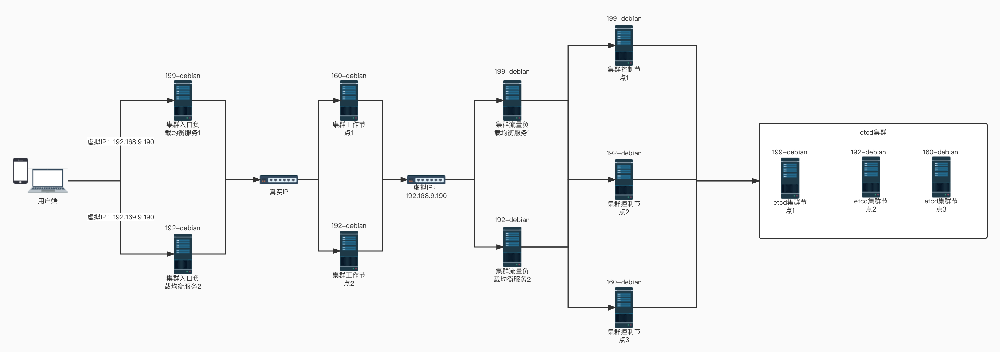

# 搭建k8s“微型集群”的实现方案

## 一、概述

### 1.1 为什么要使用k8s?

容器应用的优势在于：统一了基础的设施环境、统一了程序打包（装箱）的方式，也统一了部署（运行）的方式。从程序开发到上线，开发者不再关注基础环境的差异，使得开发者可以将更多的时间与精力花在业务逻辑上。

将应用进行容器化部署是一种行业趋势，也是合理的选择。因此，我们需要选择一套高效的容器编排工具，而`kubernetes`就是目前开源的、热门的、集群的、最适合的容器编排工具，没有之一。

### 1.2 集群搭建计划

目前，我们拥有3台主机，我们完全可以使用这3台主机搭建一个微型的集群，用于部署测试的项目。

为了集群的稳定性、高可用性，希望至少有3个控制节点、2个工作节点。然而我们没有5台以上主机，不过可以利用3台主机充当更多的角色，即某台主机既充当集群控制主机，又充当集群工作主机。不仅如此，集群中使用的各个基础组件和插件我们都在这3台主机上安装。

介于以上目标，在下文中规划出一个合理的“微型集群”的架构。

## 二、架构

每一台装上最新的`debian 11`，分别标注为：`199-debian`、`192-debian`、`160-debian`。根据我们现有的资源和环境，规划出一个微型的集群架构如下图所示

虽然是一个完整的集群架构，但是我们只有3台主机，所以把所有服务都安装在三台主机里。在这里，我们不考虑外部流量如何进到内网并进入k8s，只考虑进入虚拟IP之后的流量的走向。另外，我们把`199-debian`这台主机作为所有主机的DNS服务器。

## 四、说明

在本系列文章中，我们将从零搭建一个可用的“微型集群”。实际上，搭建kubernetes集群过程就是安装kubernetes集群所需要的各个组件，并且保证各个组件正常运行。

集群的搭建过程记录在本文档的子页面中，具体链接如下：

[01. k8s二进制安装环境准备](./f01-prepare.md)

[02. 安装containerd作为runtime](./f02-install_containerd.md)

[03. 签发集群各个组件使用的SSL证书](./f03-sign-prepare.md)

[04. 搭建etcd集群](./f04-install-ectd.md)

[05. 安装apiserver](./f05-install-apiserver.md)

[06. 搭建4层反向代理服务](./f06-install-agent-server.md)

[07. 安装controller-manager和scheduler](./f07-install-other-component.md)

[08. 安装kubectl](./f08-install-kubelet.md)

[09. 安装proxy](./f09-install-kubeproxy.md)

[10. 安装calico和coreDNS](./f10-install-calico-coredns.md)

[11. 安装traefik-ingress](./f11-install-traefik.md)

[12. 在k8s环境部署应用](./f12-deploy-app.md)

[13. 附加:安装docker](./f13-install-docker.md)

[14. 附加:安装harbor](./f14-install-harbor.md)

[15. 附加:解决centos6镜像启动容器失败的问题](./f15-run-centos6.md)

不过本系列文档在演示集群搭建的过程中，并不会特意强调kubernetes的一些基础概念。相关概念可以参考k8s官方文档：<https://kubernetes.io/zh-cn/>
