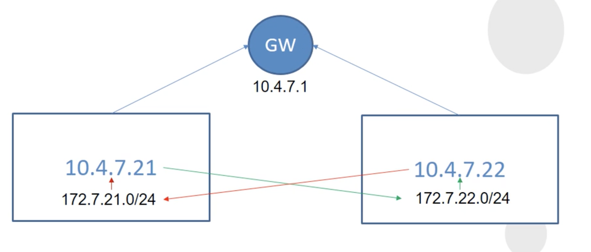

# flannel模型说明


## 1.flannel回顾

在上篇文章，我们已经在两台主机上安装好了flannel网络插件，并实现了跨主机访问docker容器。那么为什么能达到这个需求呢？实际上flannel帮我们做了IP静态路由。

如果我们在`kb21`这台主机上使用`route -n`命令查看路由情况，可以看到以下的这一条

```shell
172.7.22.0      192.168.14.22   255.255.255.0   UG    0      0        0 eth1
```

`172.7.22.0`这个网段市`kb22`这台主机上的docker容器网络，这个我们在前几节安装容器的时候就设置好的，当我们访问到这个网段的时候，将会统付哦`192.168.14.22`这个网关，即`kb22`这台主机。


同理，`172.7.21.0`这个网段市`kb21`这台主机上的docker容器网络，当我们在`kb22`这台主机访问这个网段，flannel回将ip路由到`kb21`这台主机。


综上，flannel实际上给给不同的主机设置了一套路由规则，就让集群实现了跨主机访问docker容器。可以看到flannel的框架图如下





要注意的是，flannel的host-gateway模型有个重要的前提条件，那就是所有的宿主机必须属于同一个二层网络下，也就是说它们指向的是同一个物理网关设备，这样我们才能通过维护路由表的方式让不同主机实现跨主机访问docker。实际上，在k8s网络插件的多个模型中，`host-gw`模型应该是效率最高的，因为它就是一个网络转发而已。


实际上，如果我们不使用flannel，我们手动在`kb21`这台主机上添加`172.7.21.0`的静态路由到`kb22`这台主机，我们同样可以在`kn21`这台主机访问到`kb22`上的容器。如下命令

```shell
# 停止flannel服务，如果发现停止不成功，再使用kill指令停掉对应的进程
supervisorctl stop flannel-21
# 删除flannel生成的路由
route del -net 172.7.22.0/24 gw 192.168.14.22 eth1
# 再自己手动加上路由
route add -net 172.7.22.0/24 gw 192.168.14.22 dev eth1
```

在以上的命令中，如果我们停止了flannel，并删除了flannel生成的对应路由，那么我们将不再能成功访问到`kb22`这台主机上的容器。如果我们最后添加路由规则的指令，最后又能成功访问到`kb22`这台主机。

## 2. flannel的VxLAN模型

**模型简介**

接下来我们介绍flannel的另一个网络模型--VxLAN，该网络模型架构图如下所示


在这个网络架构图中，不同的主机可能属于不同的二层网络下，它们有不同的物理网关设备。通过这个模型，flannel将会在每个的集群节点上虚拟出一个网络设置，这个虚拟的网卡叫做`flannel.1`，那么在不同主机上访问其他主机的docker容器网络，将会通过这个flannel的虚拟网络隧道进行数据传送。


**启用VxLAN模型**

我们先在把`kb21`和`kb22`这两台主机的flannel停止掉，并且删除对应的路由规则，以`kb21` 为例，如下命令

```shell
# 停止服务，如果发现停止不成功，再使用kill指令停掉对应的进程
supervisorctl stop flannel-21
# 删除路由
route del -net 172.7.22.0/24 gw 192.168.14.22 eth1
```


进入到etcd的安装目录，删除etcd集群中的原有flannel配置，如下命令

```shell
./etcdctl rm /coreos.com/network/config
```

设置 flannel新的网络模型，如下命令

```
./etcdctl set /coreos.com/network/config '{"Network":"172.7.0.0/16","Backend":{"Type":"VxLAN"}}'
```

设置好新的类型之后，再启动flannel，以`kb21`为例，如下命令

```shell
supervisorctl start flannel-21
```


启动服务之后，我们使用`ifconfig`查看网卡信息，可以看到多出了一个名为`flannel.1`的虚拟网卡，再次访问其他主机的docker容器IP，如果能正常访问，代表服务已经正常运行了。要注意的是，如果我们需要验证通过flannel的VxLAN模型在`kb21`这台主机去访问`kb22`这台主机的容器，这两台主机必须同时运行flannel并保证其正常提供服务，只有如此才能保证两个虚拟网络能通过flannel联通。

## 3. VxLAN与直接路由混合模型

在上面的VxLAN模型中存在一个明显的缺点，那就是即使两台主机在一个物理网关之下，还通过flannel的虚拟网络去访问另一台主机的容器，显然效率会大打折扣。我们希望在同一个网关下，不同主机之间的互相访问对方的容器，能直接路由，这就是VxLAN与直接路由混合模型。我们只需要在VxLAN模型的配置上加一个`Directrouting`参数即可实现。如下

```shell
{"Network":"172.7.0.0/16","Backend":{"Type":"VxLAN","Directrouting":true}}
```

我们只需将etcd中的`/coreos.com/network/config`键设置为如上值，并在所有节点重启flannel，即可实现VxLAN与直接路由混合模型。启用该模型之后，flannel会默认使用VxLAN模型，但是如果 flannel发现两台主机在同一个物理网关下，flannel直接使用`host-gw`模型。


